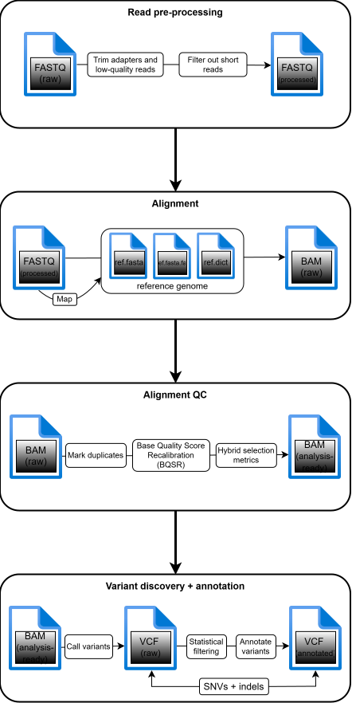

# Overview of the pipeline: What are we doing here?
Let's dive into an overview of what stages are actually involved in this pipeline. The process of putting together even just a conceptual pipeline was honestly pretty convoluted, but that's research for you. I did eventually manage to put together a rough sketch of what I wanted my pipeline to accomplish, which I describe below. I think this is a good place to start because it describes the steps involved in a very general way, meaning I am not thinking about which specific sets of tools I'm going to use yet. In other words, I'll go over *what* I'm trying to do before I get to *how* I will try to do it. I'll talk more about the specifics of each step in their own dedicated Markdown files. 

To remain true to the spirit of documenting my learning process, please allow me to first go over how I landed on my concept. I started by referencing [this SOP](https://h3abionet.github.io/H3ABionet-SOPs/Variant-Calling) by H3ABioNet to outline the general steps before getting into the details. The most recent reference in their bibliography is from 2018, which likely makes this page about eight years old at the time of writing (2026), but I figured the core framework was still sound. Keeping in mind that I wanted to follow GATK's Best Practices guidelines (and also in search of more up-to-date sources), I dug around their website and found these articles on [data pre-processing](https://gatk.broadinstitute.org/hc/en-us/articles/360035535912-Data-pre-processing-for-variant-discovery) and [germline short variant discovery](https://gatk.broadinstitute.org/hc/en-us/articles/360035535932-Germline-short-variant-discovery-SNPs-Indels). I used these three sources as jumping off points for building the blueprint of my pipeline, with additional sources sprinkled in where they became relevant.

## Phase 1. Read pre-processing
First, we need to make sure the data are good enough to be worth analyzing. If the data quality is low, the analysis results won't mean anything. After the sequences clear the initial screening, they'll need to be prepped for analysis. You could also call this phase quality control, but in my opinion, something akin to "quality control" happens in basically every other step throughout this entire process. Half of the workflow is quality control. You'll see what I mean.

File format: FASTQ --> FASTQ (but better)

### Step 1.1 Adapter trimming
Adapters are nucleotide sequences that are ligated to the ends of DNA fragments to help with library preparation. They are useful for sequencing, but they're not part of the original DNA sample, so once they've done their job and we have our reads, we want to get rid of them. If you know who sequenced the sample, you should also know what the adapter sequences are so you can pass them into your trimming tool of choice. For example, [Illumina](https://knowledge.illumina.com/library-preparation/general/library-preparation-general-reference_material-list/000001314) tells you which sequences to use for this step, depending on which of their kits you used.

### Step 1.2 Trimming low-quality sections of the reads
Even after the reads lose their adapters, their ends might still be low-quality. It's just part of the process. In this step, those low-quality read ends are detected (this information will be included in the FASTQ file) and trimmed. 

### Step 1.3 Filtering out shortest reads
If the trimmed reads end up being too short, they'll have a hard time mapping to the reference correctly (aka, they'll map to the wrong spots). It's safer to just get rid of these tiny reads than to risk misalignments. The exact value of the cutoff is context-dependent, so I'll get into that later.

> **Note 1**: The Broad Institute actually starts with workflow with uBAM files, not FASTQs, so this step is absent from their workflow. They explain why they use uBAMs in [this article](https://gatk.broadinstitute.org/hc/en-us/articles/360035532132-uBAM-Unmapped-BAM-Format); it basically comes down to storing metadata. This includes the Exome Germline Single Sample Pipeline that I want to use for comparison later in this project. However, I've chosen to start with FASTQs anyway, mostly on account of data availability. GATK does offer a workflow for converting paired FASTQs to uBAM as a [Terra workspace](https://app.terra.bio/#workspaces/help-gatk/Sequence-Format-Conversion), which I'll probably end up using for testing their pipeline.

> **Note 2**: I've decided to make the inclusion of the above pre-processing steps optional. The reason for this is discussed in [this Markdown](03_data_pre-processing.md)

## Phase 2: Alignment
This is what GATK actually considers the pre-processing stage, since their input is in uBAM instead of FASTQ format. Regardless, this phase largely involves mapping the reads to the reference genome, then running some quality control to programmatically smoothe out the aligned BAM, so to speak.

File formats: FASTQ --> BAM

### Step 2.1 Map to reference
First, we align (or map) the reads to the reference genome so we can figure out which reads are from which regions in the genome. Note that H3ABioNet mentions the b37 bundle as the standard reference for WES (and WGS) analysis *pending* the completion of GRCh38/hg38. Lucky for us, the GRCh38 bundle was completed ages ago at this point (and is now the [standard recommended](https://gatk.broadinstitute.org/hc/en-us/articles/360035890951-Human-genome-reference-builds-GRCh38-or-hg38-b37-hg19) by the GATK team), so we're gonna use that instead. It is also best practice to generate an [index file and a dictionary file](https://gatk.broadinstitute.org/hc/en-us/articles/360035531652-FASTA-Reference-genome-format) to accompany the reference FASTA, so I'll do that as well.

Once alignment is done, we should have a fresh BAM file on our hands. (Depending on what aligner and parameters you used, you might end up with a SAM file instead. It's just another flavor of the same thing, but [GATK recommends BAM](https://gatk.broadinstitute.org/hc/en-us/articles/360035890791-SAM-or-BAM-or-CRAM-Mapped-sequence-data-formats), at least if you're using their toolkit.)

### Step 2.2 Mark duplicates
The same way you're inevitably going to have some low-quality read ends, you're going to have duplicate reads. In this step, we use a tool to identify and tag read pairs that are likely artifactual duplicates from the sequencing process. This makes it so there's only one unmarked copy of each unique read pair. The tagged pairs are usually ignored for the rest of the analysis; for this reason, this step is also called de-duplication. 

GATK Best Practices also states that the reads should be sorted into coordinate-order at this time to prep them for the next step.

### Step 2.3 Base quality score recalibration (BQSR)
Base quality scores are per-base estimates of the correctness of each base call. They are assigned by whatever technology was used to sequence the samples, and sometimes they're inaccurate or biased. The point of this step is to correct for those errors based on the data. I think GATK explains it pretty well, so I'll just quote them here:

> The recalibration procedure involves collecting covariate measurements from all base calls in the dataset, building a model from those statistics, and applying base quality adjustments to the dataset based on the resulting model.

Because base quality scores are effectively measures of our confidence in the correctness of our base calls, the variant calling steps that happen downstream depend on these scores to determine how much we can trust that an observed variant is, in fact, a variant. It is therefore important to recalibrate them to be as accurate as we can reasonably manage. In fact, it's important enough to have its own [dedicated article](https://gatk.broadinstitute.org/hc/en-us/articles/360035890531-Base-Quality-Score-Recalibration-BQSR) by the GATK team.

### Step 2.4: Hybrid selection (exome) metrics
This step is specific to exomic data (at least in the context of this pipeline) and is described mainly by the GATK team, which I suspect may have Implications for which tool I end up using for it.

The idea is that an exome is basically a subset of a genome, which means we need to separate the exonic sequences from the rest of the genomic DNA. [Hybrid selection](https://gatk.broadinstitute.org/hc/en-us/articles/360035890911-Hybrid-selection-exome-preparation) is the general term to describe the selection of specific sequences for targeted analysis. The way I understand it, the actual hybrid selection happens in the lab; on the computer, we run QC metrics to determine the quality of the coverage of the regions we are interested in. 

## Phase 3. Variant discovery
Okay, now we're going to have some fun. It's time to find those variants!

File formats: BAM --> VCF

### Step 3.1 VARIANT CALLING TIME
Finally. The moment has come. We're gonna find some dang variants.

Basically, we're going to use a variant caller, and like with every other step, which one you use will depend on which kinds of variants you're looking for (i.e., somatic vs germline, etc.). In any case, we'll end up with a VCF file containing the variant calls. At long last, the pipeline will live up to its name as a variant discovery pipeline. 

> **Note 3**: Here's where we see another Broad-specific departure from the standard workflow. Instead of regular VCFs, the Broad's workflows output [genomic VCFs](https://gatk.broadinstitute.org/hc/en-us/articles/360035531812-GVCF-Genomic-Variant-Call-Format), or gVCFs. By the most general definition, gVCFs are just VCFs that records all sites in the genome/exome, whether there's a variant there or not, along with a confidence metric for each position. Non-variant sites can either be listed as individual records or blocked together based on genotype quality. The gVCF format originated from a need to facilitate efficient joint calling across cohorts—in other words, it was created to address a scalability issue. Because I'll only be analyzing one sample at a time, I don't think it will be critical for my pipeline to use gVCFs, though if I end up using a tool that produces them, then it probably won't hurt, either.

### Step 3.2 Statistical filtering
Sometimes, a site that looks like a genetic variant is actually yet another artifact of the process. This might be a side effect of trying to maximize sensitivity in order to reduce the chances of missing variants. In this step, we aim to differentiate the false positive variants from the true positive variants and filter out the former. 

The GATK team developed the [Variant Quality Score Recalibration algorithm](https://gatk.broadinstitute.org/hc/en-us/articles/360035531612-Variant-Quality-Score-Recalibration-VQSR) for this step. This is a machine learning algorithm that calculates and assigns a new quality score (variant quality score log-odds, or VQSLOD) to each variant based on multiple dimensions of information. It's pretty cool because it makes room for nuances within sets of annotation values rather than setting hard cutoffs. /////

### Step 3.3 Annotating the variants
Now that we have our variants, we need to extract *meaning* from them. According to H3ABioNet, the particulars of how we go about doing so are highly dependent on our data and objectives, so much so that they can't even outline steps that are widely applicable to various situations. Therefore, when the time comes, I'll look for a tool that lends itself well to an **exploratory analysis** of the short variants found in an exome (mine). I realize that's probably casting a pretty wide net, but we'll see where we land.

## Phase 4. Data report and visualization
I have a grand vision of building a locally hosted interactive report that tells you Things™ about the exome that was analyzed. But what will the Things™ be? Honestly, I'm not sure yet, but it will probably at least include the annotated variants and contextual information like the reference genome, metadata about the sample(s), etc. This is kind of separate from the pipeline itself, but I think it would be nice to have a nice little report at the end that shows what I actually did.

## Summary
Basically, the pipeline will look like this: 

I didn't include Phase 4 in the diagram because I haven't decided how I'm going to do it yet. I'll update it when I figure it out.