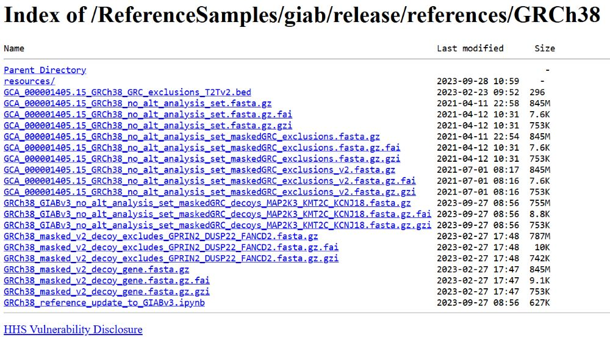
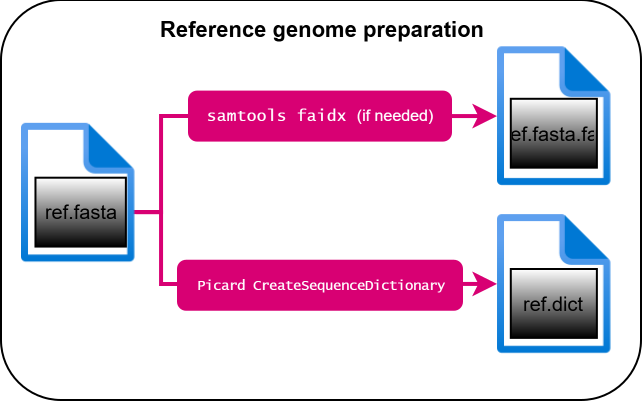

# Choosing which data to use

Before anything else, I need data to analyze. I haven't gotten my exome sequenced yet (*yet* ...), so I will have to make do with publicly available datasets, plus references. Since I'm building this pipeline from the ground up, I want to make sure it actually works, and the way to do that is to use benchmarks. Early on, I read a paper titled "Benchmarking of variant calling software for whole-exome sequencing using gold standard datasets" by Wong *et al.* (2025). It's a fairly recent paper that's highly relevant to what I'm trying to do and lists the datasets the authors used, so I figured it to be a pretty good guideline for choosing my own datasets. This team used benchmark sets by [Genome in a Bottle](https://www.nist.gov/programs-projects/genome-bottle), which I was thinking about using anyway since GIAB is a reputable source of benchmark and reference datasets. 

That said, Wong et al. don't seem to explicitly mention where they got their GRCh38 reference genome, which fudges things a little because there are a few different places where you can get the FASTA for the genome. In the end, I decided to get my FASTA and associated files straight from GIAB itself, through the links provided on their homepage. 

Navigate to the file directory ...

Uh-oh, there are like 18 slightly different FASTA files for the same GRCh38 genome! Oh, wait, just scroll down the README and they'll tell you that the latest refined version is `GRCh38_GIABv3_no_alt_analysis_set_maskedGRC_decoys_MAP2K3_KMT2C_KCNJ18.fasta.gz` (last modified in 2023). Phew. The README also provides an abbreviated name so I don't have to type that whole thing out every single time: `GRCh38-GIABv3.fasta.gz`. I'll keep it bgzipped for now.

GIAB also provides indexes for the FASTA file, so we'll grab one of those as well. I think I will end up decompressing the BGZF and pass the FASTA itself through the pipeline, so I decided to take `GRCh38_GIABv3_no_alt_analysis_set_maskedGRC_decoys_MAP2K3_KMT2C_KCNJ18.fasta.gz.fai`. I'll abbreviate the filename similarly to the FASTA, so it'll be `GRCh38-GIABv3.fasta.gz.fai`. Great! Let's move on.

For the samples, Wong's team states that they used three GIAB WES sequence reads, acquired through the NCBI SRA (National Center for Biotechnology Information Sequence Read Archive, if you're not familiar). The datasets are pretty standard (gold standard, even), and they're referred to as HG001, HG002, and HG003, respectively (or NA12878, NA24385, and NA24149, also respectively). In the interest of remembering that these samples came from human beings, it is worth saying that HG001 was provided by a Caucasian female, and HG002 and HG003 each were provided by an Ashkenazim Jewish son-father duo (in that order). 

When retrieving the FASTQ files, it is important to keep track of the SRA accession IDs for both the experiment and the run. I admit I wasn't familiar with this accession system, so I consulted the [SRA Run Selector Help page](https://trace.ncbi.nlm.nih.gov/Traces/study1/?go=help) to figure out how these IDs were different. The IDs themselves are provided in the paper, so I did my best to match them:

| Sample         | Experiment accession ID | Run accession ID | Sequencing instrument                       | Exome library prep kit                   |
|----------------|-------------------------|------------------|---------------------------------------------|------------------------------------------|
| HG001/NA12878  | ERX1966271              | ERR1905890       | Illumina HiSeq 4000 paired-end (2 x 150 bp) | Agilent SureSelect Human All Exon Kit V5 |
| HG002/NA24385  | SRX1453593              | SRR2962669       | Illumina HiSeq 2500 paired-end (2 x 125 bp) | Agilent SureSelect Human All Exon Kit V5 |
| HG003/NA24149  | SRX1453614              | SRR2962692       | Illumina HiSeq 2500 paired-end (2 x 125 bp) | Agilent SureSelect Human All Exon Kit V5 |

The authors also mentioned that they downloaded a Region BED file from Agilent, but I wasn't able to find the design ID. After some hunting and deduction, I settled on what I am *pretty sure* is the file they used: `S04380110_Regions.bed`. I downloaded the bigBed file from UCSC's public directory and converted it back to a BED, and I'm just kind of hoping I got the right one. 

I also need truth sets for each sample. GIAB provides benchmark VCF and BED files for all three samples on the GRCh38 reference genome. The latest version these files have in common is NISTv4.2.1, which is the same version the authors used in their study. I went ahead and took those as well. The filenames are kind of long, but it feels prudent to keep them that way this time.

The table below lists the files I'm using for this project. 

| Filename                                                | File format | Description                     | Where I got it | Location in directory*                                                                                                                  |
|---------------------------------------------------------|-------------|---------------------------------|----------------|-----------------------------------------------------------------------------------------------------------------------------------------|
| `GRCh38-GIABv3.fasta.gz`                                | FASTA       | Reference genome                | [NIST GIAB](https://ftp-trace.ncbi.nlm.nih.gov/ReferenceSamples/giab/release/references/GRCh38/)                                     | `data/reference/` |
| `GRCh38-GIABv3.fasta.gz.fai`                            | FAI         | Index for reference genome      | [NIST GIAB](https://ftp-trace.ncbi.nlm.nih.gov/ReferenceSamples/giab/release/references/GRCh38/)                                     | `data/reference/` |
| `HG001_1.fastq`                                         | FASTQ       | WES sample (benchmark); forward | [NCBI SRA](https://trace.ncbi.nlm.nih.gov/Traces?run=ERR1905890)                                                                     | `data/samples/`   |
| `HG001_2.fastq`                                         | FASTQ       | WES sample (benchmark); reverse | [NCBI SRA](https://trace.ncbi.nlm.nih.gov/Traces?run=ERR1905890)                                                                     | `data/samples/`   |
| `HG002_1.fastq`                                         | FASTQ       | WES sample (benchmark); forward | [NCBI SRA](https://trace.ncbi.nlm.nih.gov/Traces?run=SRR2962669)                                                                     | `data/samples/`   |
| `HG002_2.fastq`                                         | FASTQ       | WES sample (benchmark); reverse | [NCBI SRA](https://trace.ncbi.nlm.nih.gov/Traces?run=SRR2962669)                                                                     | `data/samples/`   |
| `HG003_1.fastq`                                         | FASTQ       | WES sample (benchmark); forward | [NCBI SRA](https://trace.ncbi.nlm.nih.gov/Traces?run=SRR2962692)                                                                     | `data/samples/`   |
| `HG003_2.fastq`                                         | FASTQ       | WES sample (benchmark); reverse | [NCBI SRA](https://trace.ncbi.nlm.nih.gov/Traces?run=SRR2962692)                                                                     | `data/samples/`   |
| `HG001_GRCh38_1_22_v4.2.1_benchmark.bed`                | BED         | Genomic intervals (benchmark)   | [NIST GIAB](https://ftp-trace.ncbi.nlm.nih.gov/ReferenceSamples/giab/release/NA12878_HG001/NISTv4.2.1/GRCh38/)                       | `data/truth_sets/`|       
| `HG001_GRCh38_1_22_v4.2.1_benchmark.vcf.gz`             | VCF         | Known variants (benchmark)      | [NIST GIAB](https://ftp-trace.ncbi.nlm.nih.gov/ReferenceSamples/giab/release/NA12878_HG001/NISTv4.2.1/GRCh38/)                       | `data/truth_sets/`|       
| `HG002_GRCh38_1_22_v4.2.1_benchmark_noinconsistent.bed` | BED         | Genomic intervals (benchmark)   | [NIST GIAB](https://ftp-trace.ncbi.nlm.nih.gov/ReferenceSamples/giab/release/AshkenazimTrio/HG002_NA24385_son/NISTv4.2.1/GRCh38/)    | `data/truth_sets/`|            
| `HG002_GRCh38_1_22_v4.2.1_benchmark.vcf.gz`             | VCF         | Known variants (benchmark)      | [NIST GIAB](https://ftp-trace.ncbi.nlm.nih.gov/ReferenceSamples/giab/release/AshkenazimTrio/HG002_NA24385_son/NISTv4.2.1/GRCh38/)    | `data/truth_sets/`|      
| `HG003_GRCh38_1_22_v4.2.1_benchmark_noinconsistent.bed` | BED         | Genomic intervals (benchmark)   | [NIST GIAB](https://ftp-trace.ncbi.nlm.nih.gov/ReferenceSamples/giab/release/AshkenazimTrio/HG003_NA24149_father/NISTv4.2.1/GRCh38/) | `data/truth_sets/`|            
| `HG003_GRCh38_1_22_v4.2.1_benchmark.vcf.gz`             | VCF         | Known variants (benchmark)      | [NIST GIAB](https://ftp-trace.ncbi.nlm.nih.gov/ReferenceSamples/giab/release/AshkenazimTrio/HG003_NA24149_father/NISTv4.2.1/GRCh38/) | `data/truth_sets/`|      
| `S04380110_Regions.bed`                                 | BED         | Exome target regions            | [UCSC GBDB](https://hgdownload.soe.ucsc.edu/gbdb/hg38/exomeProbesets/)                                                               | `data/samples/`   |

\* within `germspipe/`.

(By the way, if these file extensions are unfamiliar to you, check out [this Markdown](./file_formats.md) for my attempt at explaining the various file formats involved in the pipeline.)

My plan is to start with HG003, as it appears to be the smallest dataset of the three. Then, to verify that my pipeline generalizes across multiple samples, I will add HG002 and HG001. 

## Generating the sequence dictionary
This should be enough to get started, but we're missing one thing: the sequence dictionary. Technically, the index and dictionary files for the reference genome should both be generated in order to ensure they all match each other, but I trust the folks at GIAB to provide the correct index files for the GRCh38 genome. (Though, I will make my own index file(s) if I end up having to.) Therefore, all I should have to make myself is the dictionary file. There are two main tools used to accomplish this task: **samtools `dict`** and **Picard `CreateSequenceDictionary`.** GATK uses Picard, which makes sense because [Picard was also created by the Broad Institute](https://broadinstitute.github.io/picard/). samtools (Danecek *et. al.*, 2021) is a bit more established, having been around for 17 years as of 2026. Both toolkits contain a wide variety of commands and are maintained very well (both GitHub repos were updated within the last two months as of this writing in August 2026), so I don't think you can go wrong with either. However, for the purposes of my project, I'll go with `CreateSequenceDictionary` in order to keep my pipeline more or less comparable with the Broad's without being the exact same pipeline. I suspect I'll need both samtools and Picard for certain downstream steps anyway, so I'm not really limiting myself here.

