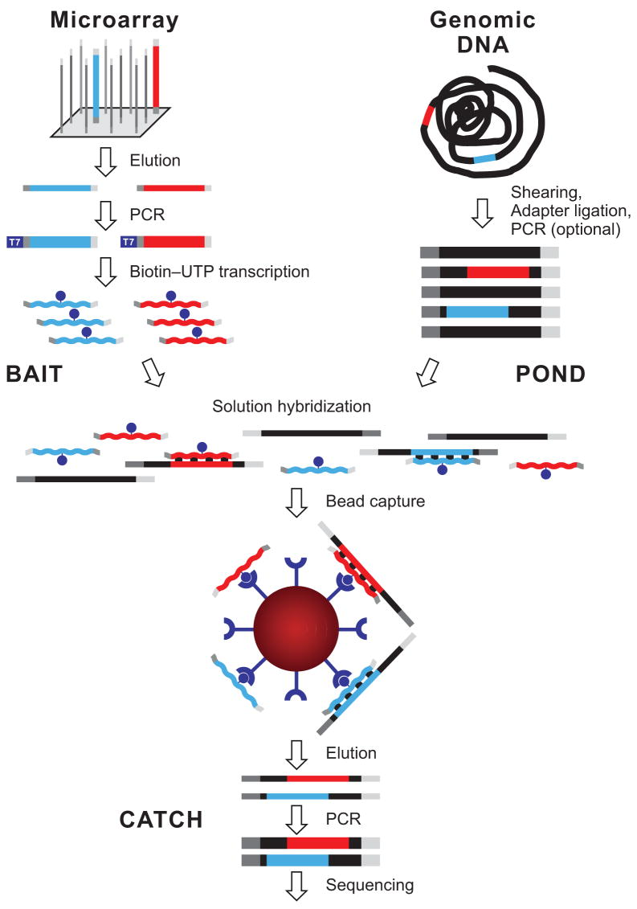

# Alignment QC
File format: BAM (raw) --> BAM (analysis-ready)

I was originally going to split these up into three Markdowns, but then I realized that was maybe getting too granular, considering they're all part of the same phase in the pipeline, the overall goal of which is to process the alignments into analysis-ready BAMs. The intermediary steps to achieve that goal involve marking duplicates, recalibrating base quality scores, and running hybrid selection (HS) metrics. 

## Marking duplicates
The goal of this step is to identify and tag read pairs that are most likely duplicates that arose from the sequencing process. We don't want these duplicates to bias our statistics by skewing read counts or causing false positive variant calls, so we need to find them and get rid of them (or just ignore them) before they cause us trouble (Barbitoff *et. al.*, 2024; Zhang *et. al.*, 2025; Samtools - Duplicate Marking, accessed September 2026). 

The process of finding and marking duplicates takes as the input a SAM or BAM file, split into data blocks, and comprises four basic steps (Zhang *et. al.*, 2025):

1. **Read data.** The data blocks are loaded into memory, decompressed, and read.
2. **Find read pairs.** Each read is assigned a unique key, and read pairs are identified.
3. **Sort read pairs.** Read pairs and unpaired reads are sorted according to the needs of the tool in use.
4. **Check duplicates.** Duplicate reads are detected, usually by comparing their 5' positions and ranking the reads by the sums of their base-quality scores (this is what [Picard `MarkDuplicates`](https://gatk.broadinstitute.org/hc/en-us/articles/54698822152347-MarkDuplicates-Picard) does, for example).

Depending on the algorithm, some or all of these steps are looped until all the data blocks are processed. 

It probably comes as no surprise that the standard tool for this step is Picard `MarkDuplicates`, which is found in the GATK alongside `MarkDuplicatesSpark`; the latter uses the same algorithm but uses parallel processing to enhance performance (Broad Institute, 2019; Zhang *et. al.*, 2025). Another performance-enhanced variation of the `MarkDuplicates` algorithm is Sambamba `markdup` (Tarasov *et. al.*, 2015). Sambamba also offers optimized versions of many major samtools utilities. Speaking of which, samtools also has its own `markdup` command, but I rarely see it mentioned in recent papers; almost everyone uses `MarkDuplicates` instead.

`MarkDuplicates` and its derivations are all very good, and the speed-optimized ones are certainly fast. However, they all come with a significant memory overhead, most of them far beyond what my laptop can handle. By the way, if at this point you've been yelling, "Use a cloud, man!" at me, you are completely justified in doing so, but I assure you, I have been contemplating this option for quite some time. If pushed, I will of course have no choice but to resort to cloud computing (which will probably cost me money), but I'd first like to see how far I can get with laptop-level resources. Thanks to **FastDup** (Zhang *et. al.*, 2025), I can at least get this far.

Essentially, FastDup is a very fast and light duplicate marking tool that uses a parallelized "speculation-and-test" strategy to run each data block through all four steps of the duplicate marking process before going back and "resolving inter-block dependencies and correcting misclassified duplicates" (Zhang *et. al.*, 2025). In doing so, it avoids having to sort the read pairs globally, which the creators cite as the major performance bottleneck in conventional workflows. Importantly, it promises *identical* results to Picard `MarkDuplicates` while being 20.13x faster and using a tenth of the memory—granted, these numbers were probably derived from the biggest dataset with the most apparent difference. That said, the figures in the paper show that even for WES datasets that have fewer reads compared to WGS datasets, FastDup outperforms the other three tools, even if by a much smaller margin. Importantly, Figure 1f shows that FastDup's peak memory usage stays well under 20 GB across all of the tested datasets. I think it's worth trying this one out.

## Base Quality Score Recalibration (BQSR)
Barbitoff and company (2024) suggested that BQSR and local indel realignment aren't strictly necessary for non-GATK variant calling because the effects of those steps are pretty small. Another paper by Bathke and Lühken (2021) describing a resource-optimized variant calling workflow expressed similar sentiments, noting that improvements are "marginal" for the computational cost; thus, they made BQSR an optional step in their workflow. Both teams cite the same 2014 paper by Heng Li (have you noticed that this guy is everywhere in bioinformatics? damn, dude), which found that BQSR and indel realignment probably aren't worth it for high-coverage datasets but should be considered for "low-coverage data or when the base quality is not well calibrated." 

I didn't see mentions of local indel realignment in the GATK Best Practices, so I'm just not going to worry about that. However, the Best Practices *do* mention BQSR, meaning I would technically be diverging from the Best Practices by skipping that step. But here are a few things to consider:

1. As pointed out in the README of my project, my pipeline is *based* on GATK Best Practices, which means I've been using the Best Practices as a guideline for how I design my workflow without necessarily strictly adhering to *their* design. This is important, because whether you call something GATK Best Practices already implies a lot about your workflow and its reproducibility (About the GATK Best Practices — GATK, 2026; Bathke and Lühken, 2021). What I'm trying to say is the occasional minor divergence from the Best Practices isn't really the end of the world.
2. The datasets I'm using in my project were used by Wong *et. al.* in their 2025 benchmarking paper, in which they report the average coverage of HG001, HG002, and HG003 to be 613, 240, and 203, respectively. I'll try to double-check that myself later, but that seems sufficiently high-coverage to me, so I think I'm in the clear in that regard. Granted, I do want to run the pipeline on my own exome someday, and I won't be able to predict the quality of that data, but perhaps this is a future me problem.
3. The only BQSR tool(s) I've been able to find are the ones from the GATK. That's not an issue, per se, but I feel like having to download the entire toolkit just for a step I might not even need to do is a little extraneous.

In conclusion, I decided to skip BQSR this time. I might go back and add it in at a later point if it becomes necessary, though.

## Hybrid selection metrics
To understand hybrid selection metrics, let's start by talking more about what hybrid selection itself actually is, why it's done, and how it matters for our use case.

Remember, the human exome is *way smaller* than an entire genome—it represents 1-2% of the human genome while also containing around 85% of disease-related variants (Belova *et. al.*, 2022). But when you extract a person's DNA and prepare it for sequencing, you get everything: the introns, the exons, and everything in between. How do you separate out the exonic sequences from everything else in the DNA soup? In other words, how do you get an exome library out of a genomic library?

You use an exome capture kit. 

The process starts by preparing the sample like you would for genomic sequencing, where you shear the gDNA into fragments and ligate the ends with adapters. At this point you'd have your sequencing library. To turn it into an exome library, you would use biotinylated baits (also called probes), which are RNA transcripts of the target regions (exons, in this case), to hybridize the DNA fragments by ligating to them. The fragments are then pulled down by streptavidin-coated magnetic beads while the uncaptured regions are washed out. The remaining exonic fragments are PCR amplified, and you end up with an exome library that's ready to be sequenced. (Gnirke *et. al.*, 2009; Seaby *et. al.*, 2016).

(Figure by Gnirke, *et. al.*, 2009.)

It should be noted at this point that the exact methods vary by exome kit (and I'm largely referencing the Agilent SureSelect All Exon series, since that was the kit used for the benchmark WES samples), but they more or less follow this pattern. There's a whole different category of methods for whole-exome sequencing that's based on amplicons, but that's outside of the scope of this exploration and won't be covered here.

Since hybrid selection is the process of capturing RNA-DNA hybrids to build an exome library, hybrid selection *metrics* are then the results of a QC analysis of how well that capture worked. The manufacturer of the kit that was used to prepare the exome library will provide a BED file (or two) containing bait and target intervals that acts as a reference for calculating the quality of the capture. In a way, you could think of it as running exome-specific QC on the WES samples, rather than a generic QC of the FASTQ files.

As far as I've found, there's really only one commonly used tool that exists for HS metrics, and that's Picard `CollectHsMetrics`. Since I'm already using Picard for other things, I think this is the way to go.

**Tools used in this step: FastDup, Picard `CollectHsMetrics`**